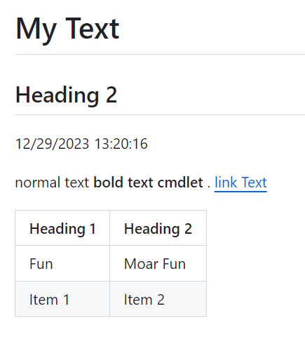
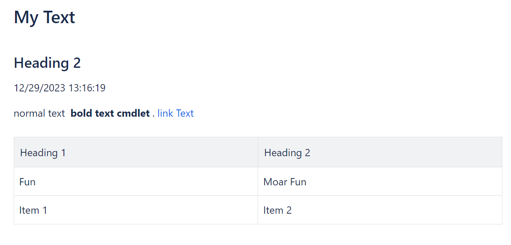

# Format-Document

This module contains an HTML-like DSL for dynamically constructing documents using PowerShell.
The same template can be rendered to any one of the following formats which render as similarly as possible.

Formats supported:

- Markdown ([GitHub-flavored](https://docs.github.com/en/get-started/writing-on-github/getting-started-with-writing-and-formatting-on-github/basic-writing-and-formatting-syntax))
- [Confluence Storage Format](https://confluence.atlassian.com/doc/confluence-storage-format-790796544.html)
- Html (with [Bootstrap](https://getbootstrap.com/) class decorations)

You can use this to automatically maintain and synchronize documentation in multiple formats such as READMEs and Confluence Wiki.

## CI Status

[](https://github.com/cdhunt/Format-Document/actions/workflows/powershell.yml)

## Install

[powershellgallery.com/packages/Format-Document](https://www.powershellgallery.com/packages/Format-Document)

`Install-Module -Name Format-Document` or `Install-PSResource -Name Format-Document`

## Docs

[Full Docs](docs)

### Examples

Generate a document in Markdown.
Each element accepts either a ScriptBlock or a String.
Use a ScriptBlock if you want more powerful text generation.
Unenclosed text will be passed through as is.

```powershell
New-Document -Type Markdown {
    H1 "My Text"
    H2 { "Heading 2" }
    P { Get-Date }
    P {
        "normal text"
        B "bold text cmdlet"
        "."
        Link "link Text" "https://google.com"
    }
    Table {
        TR {
            TH "Heading 1","Heading 2"
        }
        TR {
            TD -Text "Fun"
            TD -Text "Moar Fun"
        }
        TR {
            TD "Item 1","Item 2"
        }
    }
}
```



---

Using the same template and changing `-Type` parameter to `Confluence` renders the document in [Confluence Storage Format](https://confluence.atlassian.com/doc/confluence-storage-format-790796544.html).



You can use [ConfluencePS](https://www.powershellgallery.com/packages/ConfluencePS) to publish the content.

```powershell
$page = Get-ConfluencePage -PageID 123456789
$doc = New-Document -Type Confluence { ... }

$page.Body = $doc
$page | Set-ConfluencePage
```
